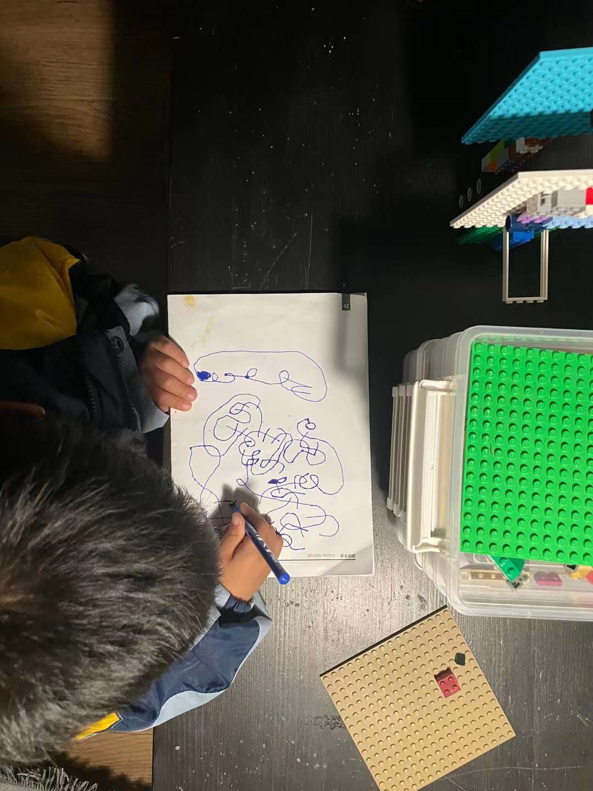
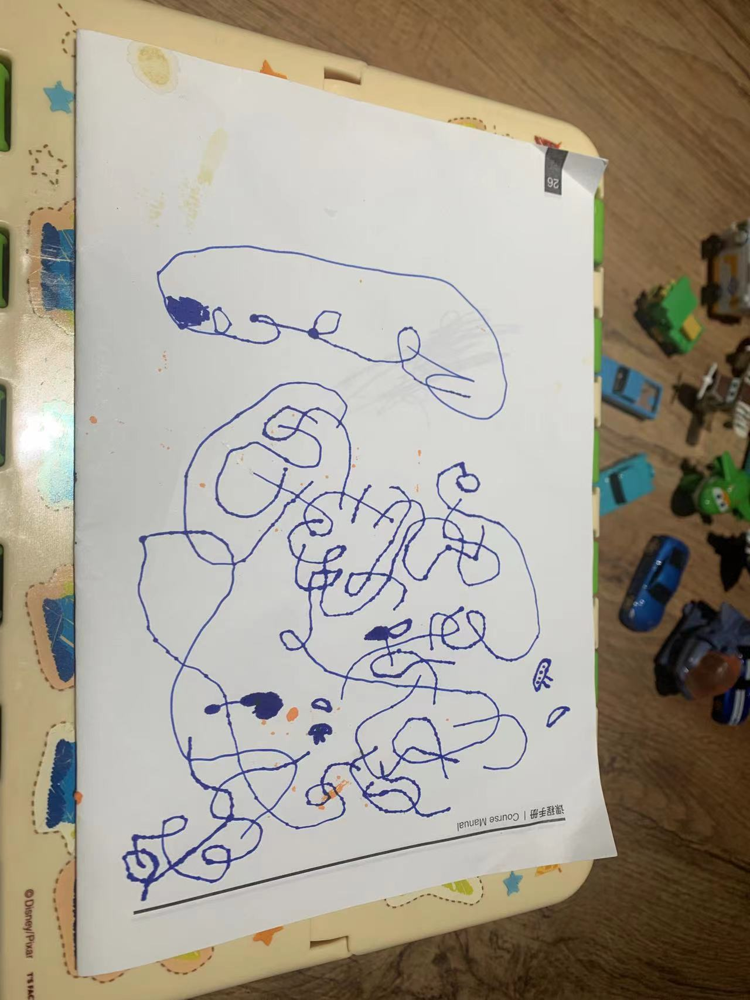
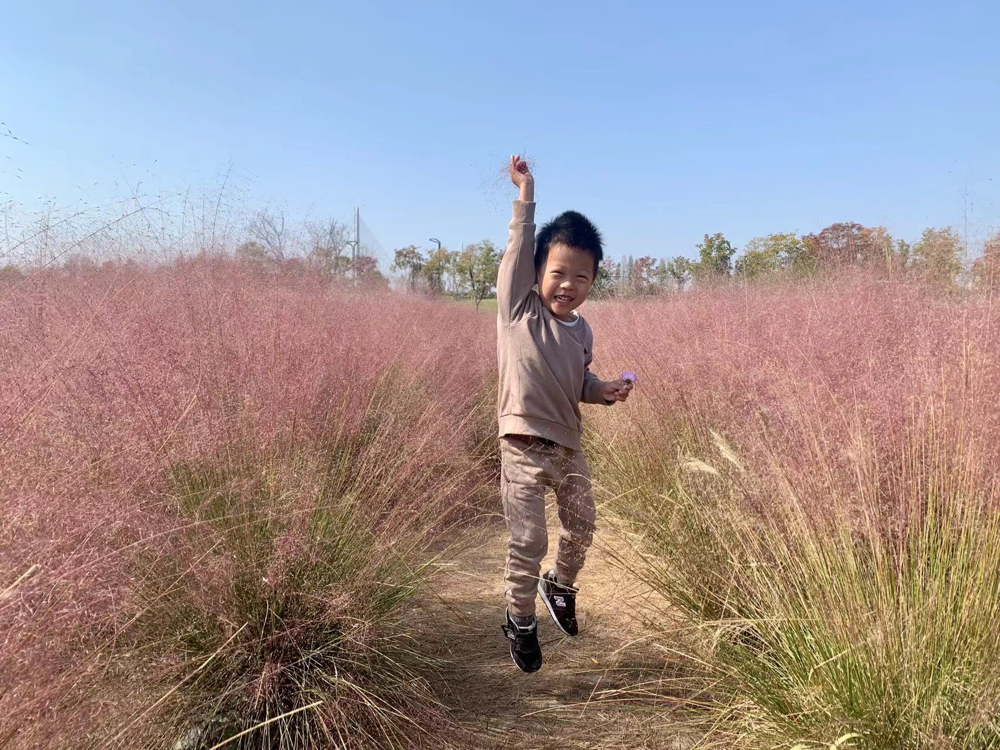

2022-12-30
-----------
最近两周是新冠症状的两周，到目前还有咳嗽的症状。想想和LCT都没有感染，尽管外公感染了。

昨天爸说他鼻子不通，并且下午电话联系不上，于是晚上到了铜陵。今天看来问题不大，我就再强调了防护的重要性，给他买了血氧仪和消毒酒精，下午准备回南京。可是开到了半路，快要到高速入口了，我又停下折回，继续在酒店住下。明天再确认他的情况。

我住在笔架山脚下，对面是笔架山广场，曾经有几天，我和爸妈一起在广场打羽毛球，我至今记得地面有很滑的大理石，而我的击球姿势大约有问题，使我的手腕扭伤了，后来就没怎么打过。想到这一件事情，再想到我和父亲现在的关系，恍如两个世界。

更早的时候，妈妈会在清晨和我一起爬山，更早的时候，我们还在笔架山脚下的水池里捞出一罐蝌蚪，那时我们还住在15栋。

我担忧父亲捱不过这次新冠。

2022-12-16
-----------
早晨起床后感觉症状轻了一点就来上班，到单位后有量了几次最高37.6。

下午4点40，38.1°，有一点点咳嗽。

2022-12-15
-----------
下午感到不舒服，测体温37.4。想来最近密接了3人，一定是跑不了了。想想和lct不在家太好了。

晚上6点下班，感觉自己生病了就应该有权打游戏了，结果dota跪了一晚上。也没有力气打很晚，在床上听着相声睡着了，相声催眠从来没有失望过。

2022-12-10
-----------
想想还在天长，和LCT电话知道他今天在把麻将当作积木拼的时候尿在裤子上，我很担心她又给出不好的反馈，果然是这样。

她对他反问、质问，然而想想是无法回答这些的，这些只会转成他心中的阴影。

每到这些事情，我都会想起小时候他不好好吃饭时我对他很凶的表现，我现在特别后悔这个事情。我现在回想，认为我是把我对她外婆、她妈妈教育方式的不满迁怒于想想的身上。我犯了特别大的错误。

今天摩洛哥胜葡萄牙，C罗回家。

2022-12-9
----------
昨天老王开会到10点，今天又到11点，这样的会议特别浪费时间然而并没有什么成果。

下班前LCT告诉我她带想想回天长了，于是整个周末我一个人在家。我隐约有些担心自己可能两天都不会下床。

今天克罗地亚点球胜巴西，而且是在落后临终场的时候扳平；阿根廷点球胜荷兰。

2022-12-8
----------
LCT打电话来告诉我想想又在幼儿园尿裤子了，是在他睡午觉的时候，我在电话里问想想他告诉我是睡着的时候，我说这不是一个错误。但LCT分明是恼怒的，主要是因为她又被老师留下说话的原因。

电话里明显听出想想烦躁，一来是因为妈妈的情绪，二来是因为金山答应给他的玩具忘记带来了，他需要一个妙脆角补偿。

我一边安慰想想不要难过，如果想吃妙脆角也可以，等我下班带给他，一边我恳求LCT不要对他发脾气。

然而我下班太晚了，也没有买妙脆角。

2022-12-7
----------
今天上午和一个大傻逼吵架了。

老王不在，早一些下班，大概7点多到家。因为昨天凌晨写材料，我已经困得不行了，但我想我必须在饭后带想想去操场活动一会儿。

今天我们带的是足球，他已经很久没有踢足球了。到8点20，我实在很难坚持就回家了。到家后完全没有说一句话的力气就躺下睡了，外面听到他和小宇玩的一些声音，大概10点他才上床。

2022-12-6
----------
按昨天跟想想的约定，我今天下班早了不少，虽然也加了一会，但还是在7点到家了，他刚好下篮球课。

今天家里闻起来没有昨天的阴霾。吃完饭，我带他出去到操场玩篮球，下楼的时候他还叫上小宇一起。

我们三人互相传了会篮球，这之中，明显想想更加遵守规则，而小宇就完全无法遵守。甚至想想自己还对小宇说：“你这是在表演‘爆裂飞球’吗？我以前小时候也像你一样，但现在我学会遵守规则了！”之后和小宇比赛拍球，91:14碾压。

我们大约8点半回家，想想邀请小宇到家里玩，大方地把最喜欢的白桃味糖果分享给小宇。一直到超过9点，在我的催促下，小宇才回家，想想还穿上鞋送他下楼又独自走回来，尽管小宇很不懂礼貌地说“我不要你送”，也没有说谢谢。那一刻我在心里超爱善良的想想。

晚上洗漱的时候我问他“今晚和谁睡觉啊？”他说：“和爸爸，因为妈妈不让我们睡大房间。”看来昨天的事情还是记得的。

在床上他很不安静，要跟我玩奥特曼打架，直到我拿出手机念日记给他听——好像每次这样都比较容易让他安静下来，特别是我念到11月10日关于记忆和遗忘的部分，最后一句是“也可能是懵懂揣测到人生（省略了‘的悲剧’）”他回答：“没有！”不禁生出一丝喜感。

睡到半夜12点，我看到王博士发来的消息，需要我立即开始写材料，明早8点交，我一刻钟之前写完了，现在是凌晨3点半。

补记：当我一进到被窝里，想想就紧紧抱住我的胳膊。

2022-12-5
----------
晚上吃饭后回家（上班一个月，开会吃饭已经第5次了），大概10点，想想还没有睡着，我走过去他说：“我一晚上都没有睡觉，因为妈妈吵我的。”妈妈一言不发，我也没说什么就躺下陪他。

后来他安静不说话，我以为他睡着了，就问LCT：“你是不是又说了过分的话？”

原来想想并没有睡着，他回答到：“妈妈把牙膏挤在我的脸上，还挤在我的头上，还挤在我的身上。”

“那么妈妈为什么要这样做呢？”

LCT说到：“你要他自己说！他要吃牙膏！而且他在家里站着尿到裤子！”

我说：“那么你明确告诉他不可以，告诉他该怎么做啊。”

LCT：“我不会，我只会用我的方式。”

我：“你这样教育没有用，而且你这样对他不会心痛吗？”

LCT：“不会！你们都走吧，让我一个人。我不想和你们在一起”当着想想的面这样说。

我把想想抱到另一个房间，我们平静地聊了一下。原来他今天犯了三个错误导致妈妈发脾气，其中之一是在画画的时候尿裤子了，另一个是吃饭的时候不太积极，最后一个就是吃牙膏。

画画的时候，他不想中断自己正在画的线条，所以就没有去厕所，我告诉他，如果他认为画很重要，那么不是一个错误，但是今后更应该在画画前就去尿尿。这件事情是可以原谅的。

吃饭的事情，他说他认为妈妈原来要求吃生菜，后来又被要求吃鸡蛋，他认为这是妈妈说话不算话，但最后的结果是他把饭吃完了。我告诉他吃饭是自己的事情要自己努力，这件事情也是可以原谅的。

吃牙膏的事情，他可能只是好奇，我也原谅他了。

他笑着说：“这样三件不好的事情就都变成好事情了。”

他还说，当妈妈和外公发脾气的时候，外公会拿筷子或者别的东西敲打他的手。事实上，外公不但会没有原则地过分宠溺哄着他，确实也会突然地发脾气为了他自己心中的“规则”。我不喜欢他这样对想想。

然后他就在我身边安静睡了。晚上又把床单尿湿了。

2022-12-4
----------
今天早晨起床后吃了鸡蛋饼，还好全部吃完了。从穿衣服开始他就比较闹，我觉得这周他无理取闹的表现比以前多，我认为这是这周我陪他太少的原因，不止一周，从上个月14号出差到现在，可能有3周了。

晚上睡前聊天，我们聊到了为什么不能一直陪他玩呢，因为要上班，为什么要上班呢，因为要赚钱，为什么要赚钱呢，因为要去做想做的事情，那么想想想做什么呢？

这是想想第一次说出自己的理想，并不是宇航员，而是宇宙飞船设计师。

2022-12-3
-----------
上午起床后和想想读完了一整本《DK儿童太空大百科》，有点意外这么大一本书也可以这么快读完——确实有一点潦草。

读完就是中午了，我们一起去景枫去吃马记永拉面，他发挥正常，几乎吃了完整一份面和一根15块钱的羊肉串。这是他第一次成功用筷子，我都没怎么教过他，无师自通，小小纪念一下。

之后他还想再吃羊肉串，所以我们又去盒马买了两串。我们从家走到景枫，又从景枫走到盒马，最后从盒马走回家，实在走了不少。

回到家里差不多有4点了，看了会动画片之后吃晚饭，吃得也还不错。

晚上我们一起睡觉，我给他说宫崎骏的动画片，说了龙猫，说了千与千寻，说了天空之城，说了萤火虫之墓，……说着说着，他睡着了，我也睡着了。

.. image:: xx/20221204151433.png
    :scale: 10

.. image:: xx/20221204151440.png
    :scale: 10

2022-11-30
-----------
今天有同事注意到，似乎从20号起到今天我都没有睡好觉过，而我自己注意到的是，除了上周六在家，其他时间很久没有陪想想了。

至少昨天我9点就上床陪她了。

2022-11-21
-----------
5:08 AM

生物钟好像乱了，12点看世界杯，大概半小时睡着了，现在想到个工作，怕忘了就起来立刻做。

2022-11-20
-----------
0:55

43小时没睡觉了，mark一下。

18号上午6点起床，从六安场出来，核酸、开会，直到下午7点多到家，晚上10点到马鞍山，然后一个通宵改PPT。

19号开一天会，晚饭后回到宾馆，改PPT到现在。

2022-11-13
-----------
今天继续开会+加班，都没有时间陪想想玩，妈妈也不管他，他就很无聊，很烦躁，我给他看了一会电视，但效果不大，下午他实在难以忍受了，我就一边开远程会，一边抱着他跟他聊天。

终于开完了，我现在带他出去玩一会。

玩了一会儿，很乖，还陪我做核酸，我说下周我要出差了哦，就不能回家了，他说那你晚上回家不就可以了，我说好几天晚上都不能回来哦，他说：“哦？那意思是说我要和你分离了吗？”

6点多到家了才知道，原来想想午饭都没吃（妈妈和外公吃的火锅）。没有饭菜，我开始煮饭，把计划把剩余的午餐肉作菜。我虽然很不满，但竟然一点与她沟通或批评的想法都没有。

我非常淡定，就像今天想想找妈妈玩的时候，妈妈不理他，想想很烦躁，我对他说，你一直找她，她不理你，你就很烦，你不要指望她，不就好了嘛？

2022-11-12
-----------
今天要加班+开会，只有下午抽出一点时间带想想去胜太西路玩滑滑梯，不巧还下小雨了，我们只玩了一小会就回来了。

回来的时候妈妈不在家，去买饮料和做核酸了，于是我和想想吃米饭+午餐肉，他很喜欢也吃了很多饭。

2022-11-10
-----------
今天想想晚饭和午饭都吃得很好也很快，我到家他已经吃完了。

晚上和我睡觉的时候，我翻出几个月前的日记念给他听，他饶有兴趣，之后我说我会一直记下去，我们讨论起如果他长大了再看到这些会怎样的心情，他说他可能会忘记，即使看到日记也想不起来。

我说人总是这样，会记住一些事情也会忘记一些，所以我们才写日记为了记住，而正是因为会忘记，记住才更加珍贵。如果没有遗忘，记忆也将一文不值。这些东西我说出来之后自己都觉得特别好。

他变得特别温柔，过了一会儿之后竟然主动要亲我嘴，之后我要他尽快睡觉，即使他还是不想睡也能安静克服。看起来小家伙是真的有被感动到，也可能是懵懂揣测到人生的悲剧？

2022-11-09
-----------
今天上午看到一个新闻，一个孩子在学校被欺负了，他爸爸到对方家里去揍了那个小孩，还动手打了大人，

LCT把这当作一个新闻，但我却体会到它背后的意味。一旦学校霸凌发生，悲剧就是不可逆的，对孩子造成的影响几乎无法挽救，而家长做任何事情，不止是徒劳，甚至会火上浇油。

所以，对于霸凌只能预防不能挽救，而预防霸凌，只有一个手段，就是树立孩子本身的强大人格。霸凌是一个小命题，但强大人格是一个巨大的答案，不仅大，而且很难。

首先，强大的人格来自强健的体魄，所以必须通过体育锻炼塑造孩子的坚强和勇敢。

其次，要通过团队体育项目增强孩子的合作能力与团队精神，这是良好社交的基本前提。

最后，要认识和避免影响人格塑造的负面因素，喂饭、惯纵、冷暴力都是非常严重的错误。

2022-11-08
-----------
今天礼拜二，想想去学习篮球，从外公发回的视频看，他的拍球水平继续保持全班第一Y_Y

晚饭前我们有一点时间就读了两本卡蜜儿。晚饭吃得稍有些慢但也还行，他不喜欢泡饭就改了面条。

晚饭后，玩了会乐高又画了会画，保持意识流线条的创作风格。

今天坚持要和我一起睡，但妈妈不想让我睡到新铺的床单去，于是我带他到我的房间。睡前我们玩了被窝游戏和聊天。

没想到我的房间里有蚊子，于是到11点多他睡着了之后我又抱他去了大房间。

2022-11-07
-----------
早上在想想起床前出门。中午看到老师发出来的视频，在三人小组中，想想吃饭吃得最快。想起几个月前还是一枚饭渣，就算革命尚未成功，也甚是欣慰。

晚上到家的时候在吃饭的末尾，吃得多且快速，这样连续两餐都很好的表现也不知道是不是因为前面两天重启中药的效果。饭后，玩了一会乐高又画了会画，最后读了两本卡蜜儿睡觉。

2022-11-06
-----------
早晨顺利吃了鸡蛋饼+牛奶，之后去楼下拍篮球，现在已经相当熟练了。回家后我们看完了昨天剩余的玩具总动员4.

之后还是去昨天的地点骑车，尽管妈妈并不骑车，我还是坚持叫上她。骑车前我们经过了一片向日葵园地，想想摘了他认为漂亮的野花，打算回家去种。今天选择了稍微不同的骑车路线，我们沿着长江骑了大约有3-4km，又返回，这条路线十分适合骑车。然后我们准备去景枫吃饭，但路上想想睡着了，于是回家，但下车的时候他又醒来了。

再骑车去景枫，想想想吃之前吃过的兰州拉面（马记永），但妈妈不愿意，于是妈妈独自走掉，又留下我们两人吃饭。看起来他确实喜欢这面条，吃了整碗的一半，相比平时已经算是很多了。

到家之后去做核酸，又是我们两个，再回来的时候，外公来了，接下来外公要来帮忙接送，毕竟我上班太早，并且他妈妈十分不情愿去接。

当她爸爸来到家里，她就逐渐变得更加不可接近，言语里的颐指气使和指责抱怨比平时更多。你能想象吗？一个几乎不带孩子的妈妈，只要你有一点疏忽就跳出来指责你失职，我如果对抗，就是爆发战争，倒霉的还是想想。

我开始决心下周离开，住到公司旁边，这是一个小的决定，也是一个大的决定，这是正式分居的开始。

晚上我们把《嘭！一个大大的梨》读完，这次只用了两天。然后想想要和外公睡，最后还是和妈妈睡了。

.. image:: xx/20221108084128.png
    :scale: 10

.. image:: xx/20221108084135.png
    :scale: 10

2022-11-05
-----------
今天去吃方姐砂锅，计划之后去带想想吃汤包，但我临时有工作，不得不在手机上处理，于是请妈妈照顾他吃饭。妈妈为了省事，就让他一边看动画片一边吃——事实上，所有一起在外面的场合几乎都是我在照顾他吃饭，她几乎都不知道该怎么做。当我不经意看到想想时他正含着一口食物，半张着嘴，看电视忘了咀嚼，我非常不能忍就说了他妈妈完全不在意孩子。她竟然丢下一句“你们两个吃吧！”然后生气走掉了。

接下来，电话也打不通，微信也不回。

之后想想吃汤包还算顺利，我们就按先前的计划去到江心洲的奥森公园，这里确实是非常适合骑车的地方。我们转了一圈又一圈，大约骑了一个小时。

到家的时候，妈妈还在发脾气，我不认为她有任何理由，但为了想想能舒服一点，还是去讨好一样的逗她，md我像个精神分裂的傻逼。

晚餐我给他煮了粥+肉松，但他妈妈选择不吃，自己又下意面。

2022-11-04
-----------
今天终于不用开会，终于送他去上学，应该是没有迟到，早餐是面包+奶酪+牛奶。

下班也还算早，回家他还没睡，因为明天不上班，我们就看绘本，晚一点也没关系，《嘭！一个大大的梨》看了三章，然后到被窝聊天，后来我迷迷糊糊睡着了。

半夜里他被尿憋醒了三次，其中一次还哭了。

2022-11-03
-----------
继续开会，早上出门时他还没起床。

晚上到家他已经睡了。

2022-11-02
-----------
早晨继续8点开会，7点20出门，出门前我做了鸡蛋饼，但直到7点40打电话才知道想想还没起床，看来又是迟到的一天。希望今天赶得上晨锻炼。

参加营销培训，讲师和内容都LOW得不行。下午实在不能忍，提前回学校办公室了。

今天晚饭想想吃的很慢，也不多，5个煎饺，吃完的时候都冷掉了。我到家的时候他说他冷，我给他穿上衣服的时候可能已经太晚了。

晚上睡觉开始不断咳嗽，几乎连续咳嗽了3个小时才缓解。

预计明天要请假了。

2022-11-01
-----------
早晨8点开会，我7点出门，只能拜托妈妈送想想了（后来听说9点多才到学校），出门也没有去见他一面，希望今晚可以早一点回去。

营销月度会议好冗长，估计要开一整天。中午要接待Movella的供应商就和老板出来了，午饭继续听老板讲故事。

想到后天的公司月会，恐怕又是一整天，看来今天要搞定zendao才行。

晚上在床上和想想聊天，有两个坏消息，一是今天午饭吐了（估计和邓老师催有关），二是今天迟到很多的情况下，想想还是照旧去操场找同学，但是同学们已经结束晨锻了。他感到很无助，就站在摄像头下希望保安可以来帮他但是没有。扫地的老奶奶也没有来帮助他。然后他无助到哭了，最后自己去到了教室。虽然不在操场就在教室是很简单的逻辑，但这件事情对他来说确实非常陌生。

这让我意识到，想想这样一个小朋友，在他的人生中，要面对无限的陌生和挑战，不禁心头一紧。

2022-10-31
-----------
今天早晨想想吃鸡蛋饼的速度不错，几乎没要我催，而且顺利窝粑粑之后再去的学校，几乎没有迟到。

开预算会，7个多小时的会议，实际讨论也就1个小时吧，大部分是老板的生平轶事。

有点报复地在门口沙县吃了双份炒粉，到家已经11点了，想想睡着了，我也没再进门。

今天是万圣节。

.. image:: xx/20221108084123.png
    :scale: 15

2022-10-30
-----------
今天的早餐是鸡蛋饼+肉松+牛奶，全部吃完，虽然有点慢。之后我们带上篮球，骑车去小公园，遇到了丁宇宸和另一个小朋友，小朋友们一起玩了一会，然后轮流拍了一会篮球。

想想想要骑车挑战小公园的下坡，这个下坡他小时候骑平衡车的时候骑过，由于车刹不好捏，他不太能有效刹车，最终还是摔倒了。摔倒后他第一时间抬起头说了句“不疼！”然后接着说：“我想睡觉。”我猜测是快速下坡的时候太紧张的缘故。之后我们就回家了。

下午的时候，我和妈妈都没管他，他一个人在客厅画画和玩乐高，突然哭了起来，我出来发现他被桌角撞到了头。地面上所有的玩具都全部收到了抽屉和盒子里，盒子还整齐放到了角落去，而他是为了捡地面的垃圾才撞到了桌角。这实在太惊喜了。我当即决定奖励他一个玩具，吃过晚饭就上街去买。

晚饭前，我们又去小操场骑了一会车，踢了一会足球。

晚上去买玩具，他妈要买衣服就不跟我们一起，结果玩具买好了她衣服还没看好，又自己一个人去买衣服了。说好了晚上我要加班她带孩子睡觉的又跑出去，上午睡，下午睡，晚上出去逛街。现在想想在玩考古玩具，我等他睡着了再加班。

.. image:: xx\20221108084114.png
    :scale: 15

2022-10-29
-----------
一到周六想想就起床很早，生物钟优秀。今天的早餐是一片烤土司面包+奶酪+肉松+牛奶，顺利吃完。

上午我有一些工作，想想在指导下完成了一个心形折纸，之后自己独自一边画画一边构思故事了。

工作完了又是周末的例行节目——打打闹闹，想想好像特别热衷于和我打架玩。可我总是担心他这样和我打下去就真的一点都不怕我了。

中午去点都德吃之前团的套餐，不得不说有点腻。之后赶紧回来加班。

晚上睡觉的时候，想想睡不着，也没有耐心听《柳林风声》，我就给他讲《孤勇者》的歌词，每一句的意思解释给他听，他还是有兴趣的，然后就睡着了。

2022-10-28
-----------
7点半起床，吃鸡蛋饼+肉松，只剩一小口没吃完，喝了一杯牛奶，窝了粑粑。大概8点10分到学校，虽然迟到但不多。

不出意外的，我迟到了。

2022-10-27
-----------
听妈妈说想想一晚上都在说梦话，没有睡好所以继续请假。

晚上和万斌聊了2个小时，还算愉快，但他那边的岗位很高，且不说北京迁居的问题，面对一群清华博士博导做项目管理？

到家9点20左右想想还没睡，很开心给我看今天折纸的新作品（虽然不是他自己折的），然后洗漱睡觉。

2022-10-26
-----------
想想感冒严重了，咳嗽一个晚上，请假一天。

今天我到浦口报道，结果直接开会到晚上11点。到家的时候想想都睡着了。

2022-10-25
-----------
汲取昨天的教训，我今天提前20min起床做早餐，想想也比较顺利的在7点半起床了，于是早饭吃得不错还窝了粑粑。到学校的时候刚好碰到汤慕文一起进去，虽然迟到了一点点但问题不大。

下午放学时我带着自行车去接他，于是骑车返回，这样会比平时坐电瓶车有趣一点。

上篮球课（体适能），无论是遵守纪律还是动作完成，想想都是最好的，他自己也知道这一点所以很开心。

因为不上班就刷购物，一不小心就买了许多东西...

2022-10-24
-----------
无论我是否一夜没睡觉，一起床就要发脾气怪我没有去修电瓶车，没有给想想做早餐。即便我送完想想回来第一时间给她做了早餐，即便我自己都觉得自己卑微得不可思议。

当她发脾气的时候，我不回应就更甚，她越来越觉得你不是东西，而一旦我回应，就立刻过过不下去了要走要离婚，不能忍受我存在。

我问她，我究竟是伤害你了还是压迫你了，回答只是受够了这样的生活，早晨起来收拾家庭，下午去接孩子，并且只要看到我就不爽，我不在家就一切安好，只要我出现就心情不好。我说我在家这两天，无论工作还是带娃的强度都是我大，娃都是我带，没有难为你任何吧。这也没有用，就不能看到我，看到我就受不了。还问我为什么要和我一起生活，我还没回答就说不要跟我说为了想想，我说因为我们结婚了婚姻家庭都是人的责任。她说要离婚。我说你的不爽就只是你的情绪，情绪是你私人的感受，为什么别人要为你的情绪受惩罚，她说没有要你受所以要离婚，我说不光是我还有想想。我说你看我不爽就想要我消失，可世界上每个人都对你很爽吗？没有人要你消失因为人有活着的权利。她说我不要和你生活在一起。

想想，我真的不知道如何跟她沟通。我确实有时候感觉自己并不找人喜欢，比如肥胖，比如驼背，但差到我不配活着吗？每个人都应该有生存的权利，也有在家庭中获得安全权利，可是她希望我立刻死掉，无时无刻不这样希望。我有时候会不知道如何维持这样的家庭，如何维持你的安全感。

如果有一天我们真的离婚分开了。

2022-10-23
-----------
现在已经是24号凌晨2点，想想因为鼻塞呼吸不畅一直翻来覆去，而我需要在他把被子踢掉的时候给他盖被子。几分钟之前，妈妈丢下一句：“明天早晨声音小点起床可不要进我房间，吵得我一夜没睡”然后就去到另一个房间了。

感冒的原因：昨天晚上妈妈陪他睡觉中，他几乎一夜没盖被子；今天下午当我在面试的一个小时的时间里，妈妈要睡觉所以也把他的衣服脱了上床去，但是当他没穿衣服和鞋子跑下床玩玩具的时候却浑然不知，当我面试结束，妈妈睡着了，想想全身只有内裤和一件薄t恤。
说到面试，昨天我面试的时间更长，大约3个小时的时间里，想想就一直在看无聊且低级的动画片，妈妈躺在床上玩手机。

几个小时前，想想希望妈妈陪他睡，妈妈严厉拒绝了，想想竟然没有哭，默默流下了眼泪。我把这告诉妈妈，她才回心转意。之后，妈妈再诱导想想夸赞自己，想想讨好地说喜欢妈妈，并且还要声明自己不喜欢爸爸。他和我在一起很开心，而且妈妈发脾气也比我多，但他仍然要这样说，因为这样说妈妈会开心。

如此对自己孩子PUA的妈妈。

今天的日记::

   今天上午我9点起来面试，10点结束，孩子没有吃早饭在玩玩具，妈妈在看手机；
   我做早餐给孩子，热昨天剩的外卖给妈妈，和昨天一样，我是唯一不吃早餐的人；
   饭后带想想出去活动，回来就满足妈妈开车去馄饨店吃馄饨；
   然后回家，立刻就要开始下午的面试；
   面试结束看到想想没穿衣服一个人在客厅的一幕，立即给他穿上；
   陪想想玩了一会玩具，然后我很想睡一会，但是妈妈起床了，开始商量晚上吃什么，想想愿意吃上周很满意的叉烧饭，但妈妈想吃泰国菜；
   去到景枫，和每一次一样，妈妈只顾吃自己的，好在想想现在吃饭比以前自觉很多；
   回家，带孩子刷牙、洗脚、洗屁股，然后陪他睡觉，之后就是前面PUA那一幕；
   再之后就是此刻了。

这个周末，她除了摆烂就没有带过一分钟孩子，即使我工作缠身，她也除了手机就是睡觉，放任孩子看电视或者着凉。中午要吃汪家馄饨，晚上要吃泰国菜，我和想想都依她。

晚饭后，她要给我买衣服，这时候她表现出完全不了解我的样子。我最终没有买她挑选的不适合办公室的衣服，这又带来她情绪的怪兽。我目前有一件外套可以穿去上班，是14年前的一件班尼路，袖口和底边已经磨破了，再就是两件格子/条纹衬衣。她怪我既然不买就不要抱怨没有衣服穿，事实上我并没有抱怨，只是在她问我为什么穿10几年前的衣服时我回答别的不合适而已，确实对衣服我多数没有什么主张，确实这些年依她建议买的衣服都不能适合工作。

因为想想一直睡不安稳，现在我很担心他明天上学的状态。

2022-10-22
-----------
周六，4个面试，连累到想想没得出去玩了。

妈妈一直在床上摆烂，午饭和晚饭都是外卖，所幸吃的分量还行。

今天我把乐高飞机给他，作为最近一段时间好好吃饭的奖励，他很开心。下午面试完我就陪他拼完了。

想想现在有一个困扰，他总会觉得无聊，一旦停下来就不知道玩什么好，我想这主要还是我的点子太少，必须丰富一些游戏或者活动内容才行，但最考验还是我自己的体力。

2022-10-21
-----------
想想的早饭吃的还是很慢啊，每天都要迟到很桑心。

今天不用上班了，但还是有一些工作要在家做，下午再去新公司做一些准备性的沟通。

下午放学，想想和小宇一起到家里来玩，一切都好。然后到欧尚吃晚餐，豪客来的牛排，不怎么好吃，想想完整吃掉了儿童套餐里牛排和其中的半份意面。

然后去买衣服，想想就很烦躁了，他烦躁的时候，即使我严厉地叫他安静也是没有用的，直到我真的生气了他也不能发觉，当我强迫他安静点，他就会动手打人。我便忍不住更加生气了。我告诉他如果他不能认识到自己的错误，我是不会原谅他的。但他根本不打算要我原谅他。

归根结底是我平时跟他打闹太多了，他无法分清游戏和教训；归根结底是在大庭广众下他的表现让我难堪我才更生气；归根结底，我觉得还是我的失败要多过于他的任性。

我为什么这么容易心情变坏，大概是因为今天收到一份本科三年就月入50k的简历，无论真假或隐情，都让我觉得自己失败。

2022-10-20
-----------
今天办理离职，比较快，差不多半天就完成了。跟几乎所有接触的同事都一一打招呼，除了何总，与他的情感有点复杂，五味杂陈还是免了吧。明天开始不用上班了！

与同事告别的时候有很多虚伪和称赞和惋惜，但我印象比较深的是：“你的开心太明显了！整个亿嘉和都没有比你开心的人！”如果我表现得这样，还真的是挺糟糕的，哈哈哈！

回家的时候，想想的晚饭吃得略有些慢，好在最终吃完了。我叫他去洗澡的时候他说要再玩一会，然后我们约定8点45去洗澡，他尽管不情愿还是能遵守。

今晚居然要和妈妈睡？！

2022-10-19
-----------
晚上睡觉的时候，我俩觉得冷，但妈妈又不肯拿出厚被子。

::
   
   me：“我想到一个好主意，就是把沙发上的那块布拿过来，加在我们的被子上。”
   xx：“好哎！”
   me：“但是，这样妈妈可能会吵我们的。”
   xx：“那还是，不要了吧……”
   me：“没关系，如果妈妈吵我们，就吵我一个人就行了，就说是我要的。”
   xx：“那，好吧！”

过了一会儿，想想去和妈妈说了些什么，结尾的时候——

::

   xx：“妈妈，我告诉你一件事情，你不要吵我们呀！”
   mm：“什么事情？”
   xx：“那你要吵就吵我吧，不要吵爸爸。就是我们把沙发上的那块布拿到床上当被子了。”
   mm：“你知道那块布有多脏嘛？好多天都没有洗过了，上面还有猫毛！吧啦吧啦……”
   xx：“啊！啊！啊！不理你了！”

想想被妈妈吵了，很委屈也很生气地跑回床上来。我突然发现这个小家伙好男子汉啊——“那你要吵就吵我吧，不要吵爸爸。”

2022-10-18
-----------
今天早晨来不及窝粑粑了，也来不及喝奶，就抓了个面包出发了。然后我一整天就担心他在学校窝粑粑的事情。

我下班回去得早，确认没有拉到裤子。本来期望他是主动找老师去上厕所的，问过知道还是老师找他才去的，不过也没关系的。

今天的晚饭吃的很多并且很快，然后我们决定出去活动一下，到景枫买打折的面包。他骑车，他妈妈骑电动车，我就跑步跟着他。我本来计划给他乐高飞机惊喜一下，结果回家的时候忘记了，那么就下次吧。

2022-10-17
-----------
首先，今天起床还挺早，7点半起床也没闹（一起床就播放《孤勇者》的效果还不错），然后，今天又是车中粑粑的一天 。

今天9点半才到家，想想已经上床了，但没睡着。我轻悄悄地推开门，他就很小声叫我：“爸爸”，因为妈妈在旁边睡觉，并且希望他早睡，所以他不能太放肆。“爸爸来陪我聊天啊，好了妈妈你可以走了。”

当我洗漱完了上床，他迫不及待地和我钻进被窝说悄悄话，满怀开心和兴奋，这就是我人生的幸福时刻。

2022-10-16
-----------
今天的计划还是汪家馄饨，但依然没开门。想想并不在乎，反正停车就要买雨花石。今天买到的石头要小一些但也更精美，并且不再是树脂了，是真石头。

我们执着去了安德门的汪家馄饨（另一家店），总算开门了。这个早餐，想想吃了几块饼和7个馄饨，很好，100分。

之后我们在雨花台公园散步，结果刚刚开始，就被公园里的游乐场突袭了。这个游乐场里的设施没啥意思，但想想找到了自己想玩的内容，考古玩具。我们合作挖出了一些彩色玻璃石头，一个人造琥珀和一只海螺，收获还挺多，旁边其他小朋友选错了玩具就收获很少。

公园里还有一个做糖画的老人，想想选了一个龙，小时候龙最贵，我从来都买不起，只能买一些小东西。一条龙要15块钱，也不算贵，可能再过些年就再也没有了。

再走回雨花台公园，发现这个地方相当好，有非常适合读书静坐睡觉的树林，这种树林比起九龙湖和各种水库的草坪要珍稀多了，立体的自然当然比平面的好。相比紫金山，这里又非常便利，不像爬山那么周折。这样的好地方，很多年前住这附件的时候居然完全忽略了。

午饭再去到昨天的正元春，因为昨天和今天上午吃的都是馄饨，所以今天选择了汤包，他吃了3个汤包加半碗小米粥，我觉得还不错，80分。

下午按计划要到小龙湾的公园攀岩，可是想想在路上睡着了，到了目的地又睡了一会儿，我想起昨天他天黑醒来的闷闷不乐，就把他抱到草地上，轻轻唤醒他。先去玩会滑滑梯热身，然后就去攀岩。

我们至少比上一次在这里攀岩的时候高了3cm，所以我建议他选择最难的角度爬上去，他也很勇敢去做了。攀岩的顶部多了个栏杆，是防止顶部的孩子走动不小心掉下去，结果……想想在爬上去的时候后脑勺撞到了栏杆，听起来很疼。本来就有的起床气加上这个撞头，就更难受了，想想心情糟透了，我安慰了一会儿，尽管能再勉强去玩滑滑梯，但是因为人多，每次都要排队，他又不愿意了。

我们又换到九龙湖北园的大滑滑梯去，换个地方，心情就好多了，一直玩到了天黑路灯亮起来，我们要去吃饭了。

今天晚餐是景枫的禄嫂茶餐厅，想想说叉烧饭里的叉烧肉比披萨店的牛排还好吃，奶油泡着的土司面包（忘了名字）他也愿意吃。晚饭吃了不少肉和米饭，又是100分。

回家的路上，一直听《孤勇者》，一直认真地学，记住了不少歌词。说起来，这个歌词也太难记了，我听了好多遍了都没记住，想想他还有很多词不明白的，太难了。

.. image:: xx/20221016-1.png
    :scale: 10

.. image:: xx/20221016-2.png
    :scale: 10

.. image:: xx/20221016-3.png
    :scale: 10

.. image:: xx/20221016-4.png
    :scale: 15

.. image:: xx/20221016-5.png
    :scale: 15

2022-10-15
-----------
早晨我去做入职体检。

回到家大约9点，想想起床吃过早餐了，原本是计划要去省中医带想想看病，但实在觉得没啥用，而且想想最近吃饭改善了不少，于是临时决定不去了，而且把可能导致呕吐的中药先停了。

上午计划去汪家馄饨，但不巧没开张，于是在雨花台买了几块雨花石就走了，（想想最喜欢的那块石头可能是树脂的假石头）。之后去处理了一下汽车，中午到雨花台附近的正元春，想想很棒地吃了10颗馄饨，下午回家的路上他睡着了，直到6点多醒来。有很强烈的不开心，因为天要黑了，“今天还没玩呢！”

何以解忧，唯有麦当劳儿童餐+玩具。晚餐很厉害地吃了7个几块和半块鱼饼（麦香鱼）、一盒牛奶。今天一天吃饭都很好。

在麦当劳，想想先是自己一个人去向服务员报告取餐码，然后又一个人去找服务员要小勺子。要勺子的时候，有人在点餐，他排队在后面，看得出来他很紧张又激动，不停地做一些小动作来缓解自己。这可能是他第一次向大人的独立的公共社交。

.. image:: xx/20221015-1.png
    :scale: 10

.. image:: xx/20221015-2.png
    :scale: 10

2022-10-14
-----------
今天早晨虽然还有点赖床，但总算在7点半起来了（尽管时间还是紧迫的）。

吃鸡蛋饼的时候不小心打翻到地上了，我又重新煎了一个，这样又耽误了好几分钟。没时间粑粑了，我们就赶快出发。

下楼的时候：

::

    “今天我们没有在家窝粑粑，在学校要怎么做？”
    “告诉老师。”
    “如果老师不在身边怎么办？”
    “自己去卫生间。”
    “很好！”
    “但是，不是可以在爸爸车里粑粑吗？”
    “……”

好吧，这是第三次在上学路上的车里窝粑粑，这个技能我们已经熟能生巧了。

下午如约去接想想，坏消息是他又吐了，晨歇的牛奶就让他想吐了，但直到午饭吃下去才全部吐出来，于是午饭白吃了。计划今天把双歧杆菌也停了，明天去问医生。

2022-10-13
-----------
早上又是匆匆忙忙赶时间，吃鸡蛋的时候我心急了要他吃一大口，结果鸡蛋和半杯奶全都吐掉了。

我反思了一下，吐的根本原因应该是吞咽不完整——想想会把一些食物积累在咽部，以致嘴巴被塞进新食物的时候咽喉部运动摩擦导致了呕吐感。要解决这个问题必须重新学习联系完整吞咽的过程，包括确认吞咽完成后再吃新一口。

下午4点的时候，LCT打电话来说想想又拉裤子上了，带很大的怒火。她在大声批评的时候，听得到想想在车里大声申诉。尽管我告诉她这件事情不值得批评，尽管我告诉她这暂时可能是想想能力之外的要求，尽管我告诉她这根本不是一件很大的事情。但她仍然无法控制情绪，我想她是在放学接娃时感到了极大的羞辱。

永远无法控制情绪，这究竟是她的问题还是她妈的问题？

挂了电话我就往回赶，生怕看到妈妈冷暴力，想想委屈大哭的场景。还好没有，LCT带她在胜太西路小公园，尽管妈妈一言不发，但孩子和同学很开心奔跑，符合了我“鲁且愚”的祝愿。

我来了，妈妈就回去了，我就一直看他们玩，就像个麦田里的守望者。

晚上回家的路上，我和想想慢慢聊了这个事情，他在玩滑滑梯的时候，滑到地面时想要粑粑，但老师还在上面保护其他小朋友，这时在户外集体活动，他没法独自去厕所；老师不在身边，也没人可以求助，坦白说，当时就算是我，也会不知所措吧。更何况因为吃了中药的缘故，他是有点拉稀的。被妈妈训斥的时，他是怎样的心情呢？

睡前聊天的时候我们一起决定，明天要起得早一点，在家里解决粑粑，但他还是悄悄告诉我，希望明天爸爸去接他放学。

::

    “当然没问题!”

.. image:: xx/20221013-1.png
    :scale: 20

.. image:: xx/20221013-2.png
    :scale: 20

2022-10-12
-----------
想想今天在学校吐两次。上午喝奶时间和午饭时间。今天考虑减少或停止中药。

晚上我们试着一起看《漫画中国史》，结果……好像那本书对他来说根本不适龄。

2022-10-11
-----------
想想今天在幼儿园拉了三次裤子……为什么要么不来要么就三连呢？

幼儿园对他产生了一些压力是必定的。他实在很被动也是必定的。我不担心，慢慢都会好起来。

今天中集的刘总和我简单沟通了一些，但是去深圳实在是个不好接受的挑战。

2022-10-10
-----------
想想今天吃了好多啊，食其家、麦当劳，回来居然还要吃麻薯。他说今天在小公园滑滑梯把头顶撞到铁管横梁了，一定超疼。

今天徽章到家了，因为前几天的好表现，补发他一枚准时徽章和一枚坚持徽章。小朋友很开心，继续加油！

2022-10-9
----------
今天主要和各个直接工作关系的同事说明离职计划，期间我尽量不透露工作中的不顺心（也许还是透露了）。没有想到的是下午何总竟然还安排我去搞经营计划的事。

另外今天预计还要和黄鹏一起面对汪总质询，但事情的本质么，一来是有人曲解以致误会，二来汪总自己好像糊里糊涂搞不明白一样。

2022-10-8
----------
上班第一天，离职talk。与何总谈了三个小时，何总分享了很多人生故事，我感觉谈话的愉快度还是蛮高的。

当我回到家，想想已经很好地吃饭喝药完成了。今天没有运动，不过也没办法。

回忆几天前的一个想法：我们对想想的要求是不是太高了，相比一年前来说，他只不过是习得了语言，开始试着与大人交流和理解对方，但并不代表他具备了这样的能力。而我们呢，一旦可以与他对话，就默认了他应当像其他与我们对话的对象一样，应当遵守所有的规则。这绝对是无理强加。

他喜欢徽章，我在网上买了一些徽章，分别代表勇气、坚持、平静、阅读。希望这是一个寓教于乐的好主意。

2022-10-7
----------
回顾这个国庆假期：

9月30号的星期五，不记得了……

10月1日到10月2日，天长。期间去了一趟高邮，吃了一个莫名其妙的网红早餐，并且因为太莫名其妙了又接连着去吃一顿午餐，两餐都不咋地。想想的最后一顿晚饭吃了8个饺子，厉害厉害，于是我们主动给他买了薯片波波乐。

10月3日到10月4日，铜陵。和爷爷吃饭，心心念念的买玩具的愿望也实现了。去了铜官山的文创园，参观复刻的矿工宿舍和矿洞，也路过一眼我初三时住过的房屋，快要倒塌的。因为下雨取消了去犁桥或者大通的计划。

10月5日，中午吃点都德，竟然点了4份主食。下午到省中医院，几乎排队一下午，看病3分钟。这一次医生说骨龄并无明显偏小（坏消息），然后依旧开了中药，这一次是不是成药，需要代煎，对想想来说也挑战更大。并开了一个叫做“金健高素”的药，很贵，虽然明知道是智商税也接受了，那一刻的感觉是种麻木。也顺便开了些咳嗽药和头孢。

10月6日，睡到很晚起来，看了一集魔神坛斗士，然后去川嫂吃午饭，想想是吃馄饨。之后去做核酸，然后想想就在车上睡着了，回家我陪他继续睡，直到6点多。醒来就意味着今晚不得安宁了，不过比想象的好很多，大约11点又睡了。期间我们聊天的话题非常刺激，从动画片到矿石再到五行元素再到自然宇宙生命起源。

10月7日，上班前焦虑的一天。在家吃了个鸡蛋饼，然后去凤凰广场骑车，骑车是很顺利的，却不幸在跑步的时候被我脚后跟绊倒，摔破了嘴唇，肿了额头，以及流了挺多鼻血。想想是很勇敢的，很快恢复过来，还坚持骑车到金鹰去吃了午餐，午餐是昨晚团购的牛排意面，想想吃了大约半块牛排，他还挺喜欢，以后可以再去。下午出去做核算也顺便去了盒马。晚上吃饭表现不太好，我发了一点脾气，喝药的时候打翻了很贵的药，我又发了一次脾气，有些后悔。想想今天第一次喝那么一大袋中药喝完了，很了不起。晚上聊了一小会儿就睡着了，今天他挺不容易的。

.. image:: xx/20221007-1.png
    :scale: 20

.. image:: xx/20221007-2.png
    :scale: 20

2022-9-29
----------
今天在广场看到一个小哥哥骑车，他是可以自己启动的，想想看了一遍，再自己试，就成功了！

他也很高兴，第一个反应是：“爸爸！终于可以给我买新自行车了！”（之前约定的是，等学会了自己启动就买新自行车）

可这辆车还很新啊！糊弄糊弄……

2022-9-28
----------
第一次去凤凰广场骑车，难得到这么开阔的地带，比平时在操场更多一些兴奋。

晚上聊天的时候说：“爸爸那你上次为什么发脾气，我关门你还不让我关？我总是想起这件事！”

那件事情，发脾气的是她妈……但这不是重点，重点是，就像我记得我三岁时候爸妈吵架一样，只有一个画面，没有前因和后果，就一个画面，牢牢记住了。

真希望他忘掉。

2022-9-27
----------
和想想骑车去胜太西路，玩滑滑梯再骑车回家。

当时间快到9点，我与他约定再玩一会就回去了::

> “你可以再玩一会，但我们得约定一个时间。”
> “那我要11分钟！”
> “7分钟吧。”
> “不行！”
> “8分钟吧。”
> “不行！”
> “9分钟吧。”
> “不行，必须11分钟！”

好强硬啊！一点机会余地都没有！然后，到了10分钟的时候::

> “我们的11分钟还剩1分钟了哈！”
> “好的！”然后转身告诉身边新认识的小妹妹，“我们还剩1分钟，就要回家了”
> 再玩了一遍滑滑梯，就径直跑到我身边，“好了，我们回家吧！”

好讲信用啊！

2022-9-26
----------
昨晚想想睡得不安稳，我也折腾了一晚。今天早晨LCT见我们俩没起床就大发脾气。在去幼儿园的路上我告诉想想今天是我的生日。

晚上LCT突然发现了今天是我生日，说了一句话颇令我感动：“一年里面364天都在与你作对，今天总要不一样。”这听起来会有一种错觉，好像她能体会我一样。

想想吃到他想要的蛋糕和薯片，一直吃到心满意足为止。但明天又是新的一天。

2022-9-25
----------
上午的娱乐项目是《打架模拟器》，没记错的话这是我小学时候和章超小朋友最爱玩的游戏，内容就是互相打架🤺。虽然这可费劲了，但能跟自己的儿子玩自己发明的游戏可简直太棒了。

下午想想完成了骑车的重大突破，终于不必我拽他衣领了。

今天hr通知我过关了，薪资谈判我还是蛮保守的，我可能真的挺想换个环境了。如果能进入这份工作，我就算是完成了职业经理人的成就。

2022-9-24
----------
去银杏湖，挖沙+游乐场+摘柿子，nm摘柿子可真费爹，我居然挂着170斤肉上树去了！

另外说个事，今天猎头约我7点面试，我tm给忘了，7点我还在吃肥叔锅贴，接到催面的电话紧急切换模式。好在跟对方大佬聊的1个小时还行。没想到有朝一日我能跟猪厂发生关系。嗯，我觉得有一半的把握。
🐷

2022-9-23
----------
想想今天骑车绕小操场24圈，并骑车往返，再次进步，很棒！哈哈但还是必须我牵着他的衣领。

继昨天读到第4章后，今天全部读完了《一个大大的梨》，相比以前宫西达也的小故事来说，这一本中篇更显得有趣，想想几乎看得停不下来。下一本计划买卡梅拉。

读书和运动，我没有做到的事情，我试图让想想养成习惯，这是否是一种强加呢？管他呢……

2022-9-22
----------
今天下班早，回来视频家长会，然后和想想去骑车+拍篮球。篮球连续25个，虽然没有吹嘘的100个，但也进步巨大了，比起我上次见他拍球。自行车今天绕着小操场骑了20圈，即使免不了要我牵着领子，也是让我很佩服，比我那会强太多了。

2022-9-21
---------
7点半被留下参加电力的复盘会到10点半，听得难受一比，忍不住一顿发牢骚。越来越看出来自己是不想好了。

2022-9-20
---------
据说今天想想拍篮球很成功，下班晚了还没机会见识一下，很期待。看了他在篮球课的视频，手脚并用爬行的速度全班最快，厉害厉害！

2022-9-19
----------
感冒+疲惫，请假半天休息，结果被羊了个羊去了一大块，然后就接娃带娃，根本没有休息。

今天再次逼着想想去骑车，事实证明，他不愿意的事情，稍微逼一下还是可以去做的。比起几个月前的第一次骑车来说，今天又有长进，几乎可以在小操场转圈了。尽管技术合格了，但心中还有恐惧，必须要我牵着他的后衣领才可以，再练习一些一定可以摆脱。

2022-9-18
----------
去摘板栗，有几个旧机器的游乐场，想想玩得……还行。之后路过一个露营地，竟然还有皮划艇……还行。

2022-9-17
----------
挖雨花石。继上周在银杏湖沙滩毫无收获，今天总算碰对了地方，虽然有点远。在浦口挖了大概一个多小时，收获半桶石头，其中有几个还真不错。

想想今天有一个金句。路上，我们在讨论过江隧道，妈妈：“你爸爸就不谦虚，总觉得别人都没什么了不起。”想想：“（对爸爸）那有本事你来挖哎！”竟无语凝噎。

2022-9-13
---------
这学期的篮球课改到周二进行，今天去上课和拿到了橙色球衣。晚饭后还去胜太西路的公园玩了会。离开时，尽管很不情愿，但是还是能听话，要求再玩一次最后滑滑梯之后就遵守诺言。
这两天喝药的接受度也在逐渐改善。

因为篮球课，于是今天没有摸高，明天继续。

2022-9-12
----------
摸高训练器到货了，想想二话不说跳了120个，给力！在运动力方面，想想还是有一些自信心的，特别十对于跳这个项目，以及踢足球。

2022-9-11
----------
到省中医检查，骨龄偏小——晚了1年，也不知道是好消息还是坏消息。

2022-9-10
----------
到银杏湖公园，从沙滩到游乐场，全程拖营地车走过去的。如果早知道有那么远我绝对不会走的。

赶上了闭园前最后一趟摩天轮。想想的第一次摩天轮体验。
