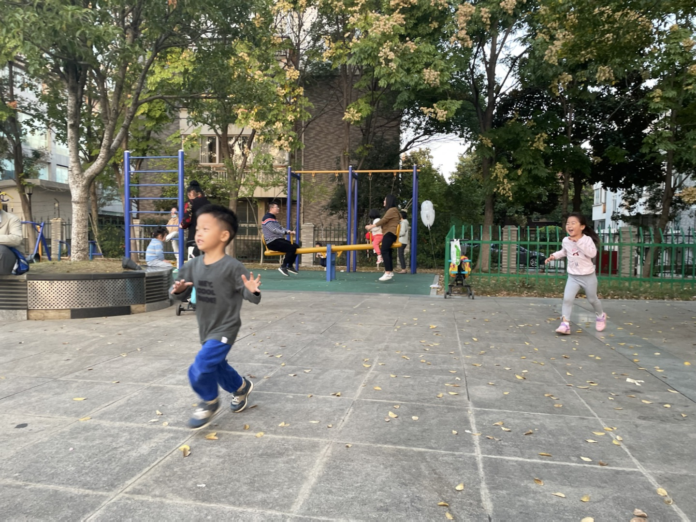
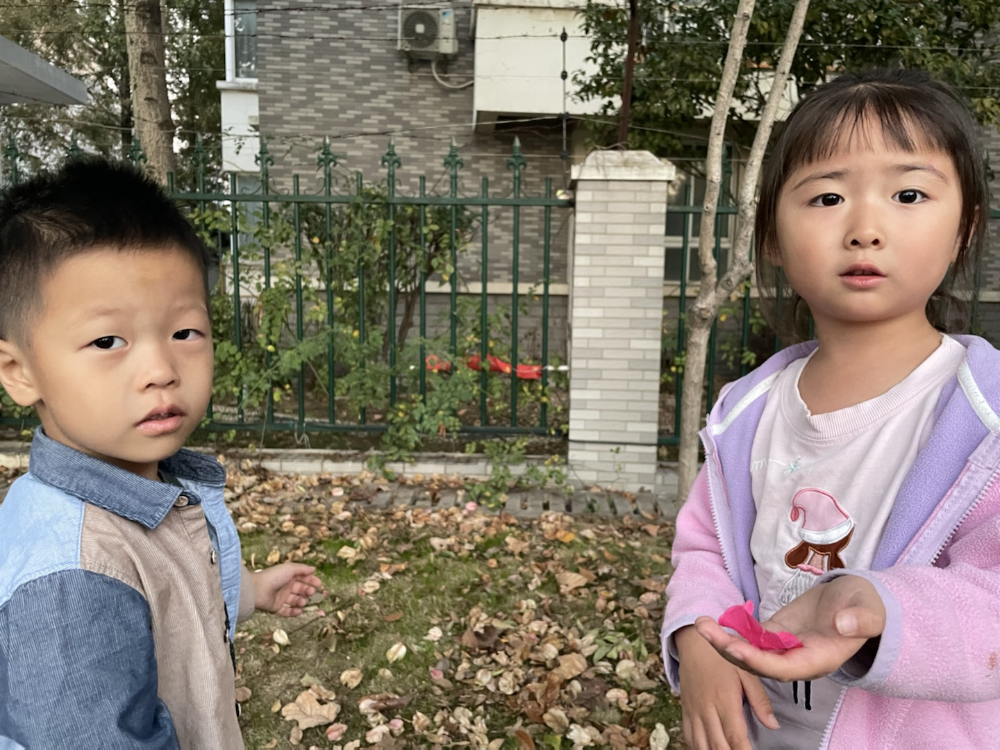
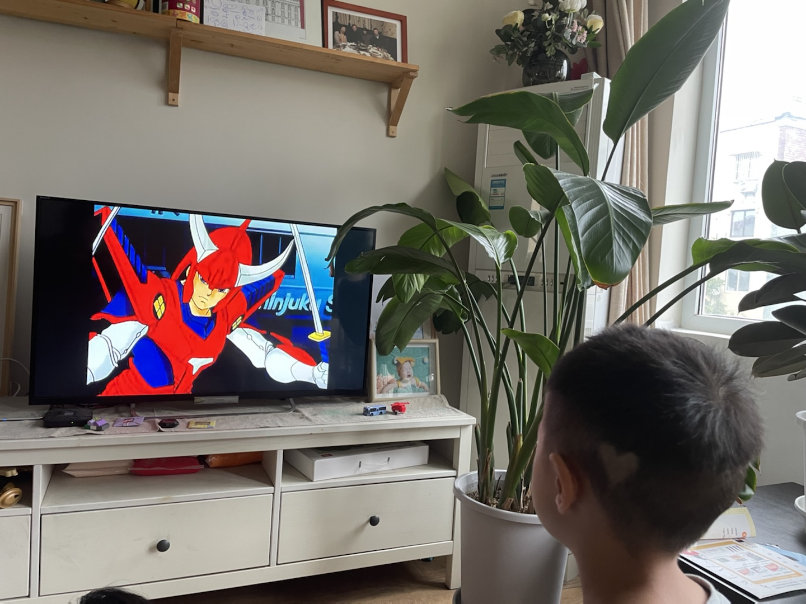
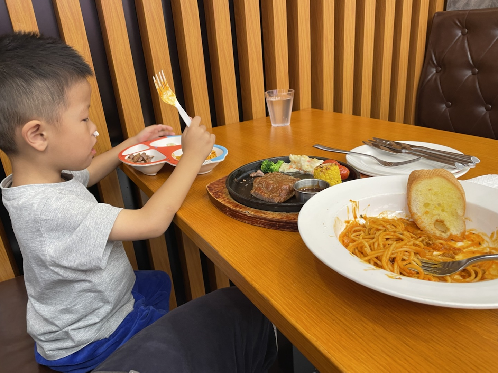

2022-10-28
-----------
7点半起床，吃鸡蛋饼+肉松，只剩一小口没吃完，喝了一杯牛奶，窝了粑粑。大概8点10分到学校，虽然迟到但不多。

不出意外的，我迟到了。

2022-10-27
-----------
听妈妈说想想一晚上都在说梦话，没有睡好所以继续请假。

晚上和万斌聊了2个小时，还算愉快，但他那边的岗位很高，且不说北京迁居的问题，面对一群清华博士博导做项目管理？

到家9点20左右想想还没睡，很开心给我看今天折纸的新作品（虽然不是他自己折的），然后洗漱睡觉。

2022-10-26
-----------
想想感冒严重了，咳嗽一个晚上，请假一天。

今天我到浦口报道，结果直接开会到晚上11点。到家的时候想想都睡着了。

2022-10-25
-----------
汲取昨天的教训，我今天提前20min起床做早餐，想想也比较顺利的在7点半起床了，于是早饭吃得不错还窝了粑粑。到学校的时候刚好碰到汤慕文一起进去，虽然迟到了一点点但问题不大。

下午放学时我带着自行车去接他，于是骑车返回，这样会比平时坐电瓶车有趣一点。

上篮球课（体适能），无论是遵守纪律还是动作完成，想想都是最好的，他自己也知道这一点所以很开心。

因为不上班就刷购物，一不小心就买了许多东西...

2022-10-24
-----------
无论我是否一夜没睡觉，一起床就要发脾气怪我没有去修电瓶车，没有给想想做早餐。即便我送完想想回来第一时间给她做了早餐，即便我自己都觉得自己卑微得不可思议。

当她发脾气的时候，我不回应就更甚，她越来越觉得你不是东西，而一旦我回应，就立刻过过不下去了要走要离婚，不能忍受我存在。

我问她，我究竟是伤害你了还是压迫你了，回答只是受够了这样的生活，早晨起来收拾家庭，下午去接孩子，并且只要看到我就不爽，我不在家就一切安好，只要我出现就心情不好。我说我在家这两天，无论工作还是带娃的强度都是我大，娃都是我带，没有难为你任何吧。这也没有用，就不能看到我，看到我就受不了。还问我为什么要和我一起生活，我还没回答就说不要跟我说为了想想，我说因为我们结婚了婚姻家庭都是人的责任。她说要离婚。我说你的不爽就只是你的情绪，情绪是你私人的感受，为什么别人要为你的情绪受惩罚，她说没有要你受所以要离婚，我说不光是我还有想想。我说你看我不爽就想要我消失，可世界上每个人都对你很爽吗？没有人要你消失因为人有活着的权利。她说我不要和你生活在一起。

想想，我真的不知道如何跟她沟通。我确实有时候感觉自己并不找人喜欢，比如肥胖，比如驼背，但差到我不配活着吗？每个人都应该有生存的权利，也有在家庭中获得安全权利，可是她希望我立刻死掉，无时无刻不这样希望。我有时候会不知道如何维持这样的家庭，如何维持你的安全感。

如果有一天我们真的离婚分开了。

2022-10-23
-----------
现在已经是24号凌晨2点，想想因为鼻塞呼吸不畅一直翻来覆去，而我需要在他把被子踢掉的时候给他盖被子。几分钟之前，妈妈丢下一句：“明天早晨声音小点起床可不要进我房间，吵得我一夜没睡”然后就去到另一个房间了。

感冒的原因：昨天晚上妈妈陪他睡觉中，他几乎一夜没盖被子；今天下午当我在面试的一个小时的时间里，妈妈要睡觉所以也把他的衣服脱了上床去，但是当他没穿衣服和鞋子跑下床玩玩具的时候却浑然不知，当我面试结束，妈妈睡着了，想想全身只有内裤和一件薄t恤。
说到面试，昨天我面试的时间更长，大约3个小时的时间里，想想就一直在看无聊且低级的动画片，妈妈躺在床上玩手机。

几个小时前，想想希望妈妈陪他睡，妈妈严厉拒绝了，想想竟然没有哭，默默流下了眼泪。我把这告诉妈妈，她才回心转意。之后，妈妈再诱导想想夸赞自己，想想讨好地说喜欢妈妈，并且还要声明自己不喜欢爸爸。他和我在一起很开心，而且妈妈发脾气也比我多，但他仍然要这样说，因为这样说妈妈会开心。

如此对自己孩子PUA的妈妈。

今天的日记::

   今天上午我9点起来面试，10点结束，孩子没有吃早饭在玩玩具，妈妈在看手机；
   我做早餐给孩子，热昨天剩的外卖给妈妈，和昨天一样，我是唯一不吃早餐的人；
   饭后带想想出去活动，回来就满足妈妈开车去馄饨店吃馄饨；
   然后回家，立刻就要开始下午的面试；
   面试结束看到想想没穿衣服一个人在客厅的一幕，立即给他穿上；
   陪想想玩了一会玩具，然后我很想睡一会，但是妈妈起床了，开始商量晚上吃什么，想想愿意吃上周很满意的叉烧饭，但妈妈想吃泰国菜；
   去到景枫，和每一次一样，妈妈只顾吃自己的，好在想想现在吃饭比以前自觉很多；
   回家，带孩子刷牙、洗脚、洗屁股，然后陪他睡觉，之后就是前面PUA那一幕；
   再之后就是此刻了。

这个周末，她除了摆烂就没有带过一分钟孩子，即使我工作缠身，她也除了手机就是睡觉，放任孩子看电视或者着凉。中午要吃汪家馄饨，晚上要吃泰国菜，我和想想都依她。

晚饭后，她要给我买衣服，这时候她表现出完全不了解我的样子。我最终没有买她挑选的不适合办公室的衣服，这又带来她情绪的怪兽。我目前有一件外套可以穿去上班，是14年前的一件班尼路，袖口和底边已经磨破了，再就是两件格子/条纹衬衣。她怪我既然不买就不要抱怨没有衣服穿，事实上我并没有抱怨，只是在她问我为什么穿10几年前的衣服时我回答别的不合适而已，确实对衣服我多数没有什么主张，确实这些年依她建议买的衣服都不能适合工作。

因为想想一直睡不安稳，现在我很担心他明天上学的状态。

2022-10-22
-----------
周六，4个面试，连累到想想没得出去玩了。

妈妈一直在床上摆烂，午饭和晚饭都是外卖，所幸吃的分量还行。

今天我把乐高飞机给他，作为最近一段时间好好吃饭的奖励，他很开心。下午面试完我就陪他拼完了。

想想现在有一个困扰，他总会觉得无聊，一旦停下来就不知道玩什么好，我想这主要还是我的点子太少，必须丰富一些游戏或者活动内容才行，但最考验还是我自己的体力。

2022-10-21
-----------
想想的早饭吃的还是很慢啊，每天都要迟到很桑心。

今天不用上班了，但还是有一些工作要在家做，下午再去新公司做一些准备性的沟通。

下午放学，想想和小宇一起到家里来玩，一切都好。然后到欧尚吃晚餐，豪客来的牛排，不怎么好吃，想想完整吃掉了儿童套餐里牛排和其中的半份意面。

然后去买衣服，想想就很烦躁了，他烦躁的时候，即使我严厉地叫他安静也是没有用的，直到我真的生气了他也不能发觉，当我强迫他安静点，他就会动手打人。我便忍不住更加生气了。我告诉他如果他不能认识到自己的错误，我是不会原谅他的。但他根本不打算要我原谅他。

归根结底是我平时跟他打闹太多了，他无法分清游戏和教训；归根结底是在大庭广众下他的表现让我难堪我才更生气；归根结底，我觉得还是我的失败要多过于他的任性。

我为什么这么容易心情变坏，大概是因为今天收到一份本科三年就月入50k的简历，无论真假或隐情，都让我觉得自己失败。

2022-10-20
-----------
今天办理离职，比较快，差不多半天就完成了。跟几乎所有接触的同事都一一打招呼，除了何总，与他的情感有点复杂，五味杂陈还是免了吧。明天开始不用上班了！

与同事告别的时候有很多虚伪和称赞和惋惜，但我印象比较深的是：“你的开心太明显了！整个亿嘉和都没有比你开心的人！”如果我表现得这样，还真的是挺糟糕的，哈哈哈！

回家的时候，想想的晚饭吃得略有些慢，好在最终吃完了。我叫他去洗澡的时候他说要再玩一会，然后我们约定8点45去洗澡，他尽管不情愿还是能遵守。

今晚居然要和妈妈睡？！

2022-10-19
-----------
晚上睡觉的时候，我俩觉得冷，但妈妈又不肯拿出厚被子。

::
   
   me：“我想到一个好主意，就是把沙发上的那块布拿过来，加在我们的被子上。”
   xx：“好哎！”
   me：“但是，这样妈妈可能会吵我们的。”
   xx：“那还是，不要了吧……”
   me：“没关系，如果妈妈吵我们，就吵我一个人就行了，就说是我要的。”
   xx：“那，好吧！”

过了一会儿，想想去和妈妈说了些什么，结尾的时候——

::

   xx：“妈妈，我告诉你一件事情，你不要吵我们呀！”
   mm：“什么事情？”
   xx：“那你要吵就吵我吧，不要吵爸爸。就是我们把沙发上的那块布拿到床上当被子了。”
   mm：“你知道那块布有多脏嘛？好多天都没有洗过了，上面还有猫毛！吧啦吧啦……”
   xx：“啊！啊！啊！不理你了！”

想想被妈妈吵了，很委屈也很生气地跑回床上来。我突然发现这个小家伙好男子汉啊——“那你要吵就吵我吧，不要吵爸爸。”

2022-10-18
-----------
今天早晨来不及窝粑粑了，也来不及喝奶，就抓了个面包出发了。然后我一整天就担心他在学校窝粑粑的事情。

我下班回去得早，确认没有拉到裤子。本来期望他是主动找老师去上厕所的，问过知道还是老师找他才去的，不过也没关系的。

今天的晚饭吃的很多并且很快，然后我们决定出去活动一下，到景枫买打折的面包。他骑车，他妈妈骑电动车，我就跑步跟着他。我本来计划给他乐高飞机惊喜一下，结果回家的时候忘记了，那么就下次吧。

2022-10-17
-----------
首先，今天起床还挺早，7点半起床也没闹（一起床就播放《孤勇者》的效果还不错），然后，今天又是车中粑粑的一天 。

今天9点半才到家，想想已经上床了，但没睡着。我轻悄悄地推开门，他就很小声叫我：“爸爸”，因为妈妈在旁边睡觉，并且希望他早睡，所以他不能太放肆。“爸爸来陪我聊天啊，好了妈妈你可以走了。”

当我洗漱完了上床，他迫不及待地和我钻进被窝说悄悄话，满怀开心和兴奋，这就是我人生的幸福时刻。

2022-10-16
-----------
今天的计划还是汪家馄饨，但依然没开门。想想并不在乎，反正停车就要买雨花石。今天买到的石头要小一些但也更精美，并且不再是树脂了，是真石头。

我们执着去了安德门的汪家馄饨（另一家店），总算开门了。这个早餐，想想吃了几块饼和7个馄饨，很好，100分。

之后我们在雨花台公园散步，结果刚刚开始，就被公园里的游乐场突袭了。这个游乐场里的设施没啥意思，但想想找到了自己想玩的内容，考古玩具。我们合作挖出了一些彩色玻璃石头，一个人造琥珀和一只海螺，收获还挺多，旁边其他小朋友选错了玩具就收获很少。

公园里还有一个做糖画的老人，想想选了一个龙，小时候龙最贵，我从来都买不起，只能买一些小东西。一条龙要15块钱，也不算贵，可能再过些年就再也没有了。

再走回雨花台公园，发现这个地方相当好，有非常适合读书静坐睡觉的树林，这种树林比起九龙湖和各种水库的草坪要珍稀多了，立体的自然当然比平面的好。相比紫金山，这里又非常便利，不像爬山那么周折。这样的好地方，很多年前住这附件的时候居然完全忽略了。

午饭再去到昨天的正元春，因为昨天和今天上午吃的都是馄饨，所以今天选择了汤包，他吃了3个汤包加半碗小米粥，我觉得还不错，80分。

下午按计划要到小龙湾的公园攀岩，可是想想在路上睡着了，到了目的地又睡了一会儿，我想起昨天他天黑醒来的闷闷不乐，就把他抱到草地上，轻轻唤醒他。先去玩会滑滑梯热身，然后就去攀岩。

我们至少比上一次在这里攀岩的时候高了3cm，所以我建议他选择最难的角度爬上去，他也很勇敢去做了。攀岩的顶部多了个栏杆，是防止顶部的孩子走动不小心掉下去，结果……想想在爬上去的时候后脑勺撞到了栏杆，听起来很疼。本来就有的起床气加上这个撞头，就更难受了，想想心情糟透了，我安慰了一会儿，尽管能再勉强去玩滑滑梯，但是因为人多，每次都要排队，他又不愿意了。

我们又换到九龙湖北园的大滑滑梯去，换个地方，心情就好多了，一直玩到了天黑路灯亮起来，我们要去吃饭了。

今天晚餐是景枫的禄嫂茶餐厅，想想说叉烧饭里的叉烧肉比披萨店的牛排还好吃，奶油泡着的土司面包（忘了名字）他也愿意吃。晚饭吃了不少肉和米饭，又是100分。

回家的路上，一直听《孤勇者》，一直认真地学，记住了不少歌词。说起来，这个歌词也太难记了，我听了好多遍了都没记住，想想他还有很多词不明白的，太难了。

.. image:: xx/20221016-1.png
    :scale: 10

.. image:: xx/20221016-2.png
    :scale: 10

.. image:: xx/20221016-3.png
    :scale: 10

.. image:: xx/20221016-4.png
    :scale: 15

.. image:: xx/20221016-5.png
    :scale: 15

2022-10-15
-----------
早晨我去做入职体检。

回到家大约9点，想想起床吃过早餐了，原本是计划要去省中医带想想看病，但实在觉得没啥用，而且想想最近吃饭改善了不少，于是临时决定不去了，而且把可能导致呕吐的中药先停了。

上午计划去汪家馄饨，但不巧没开张，于是在雨花台买了几块雨花石就走了，（想想最喜欢的那块石头可能是树脂的假石头）。之后去处理了一下汽车，中午到雨花台附近的正元春，想想很棒地吃了10颗馄饨，下午回家的路上他睡着了，直到6点多醒来。有很强烈的不开心，因为天要黑了，“今天还没玩呢！”

何以解忧，唯有麦当劳儿童餐+玩具。晚餐很厉害地吃了7个几块和半块鱼饼（麦香鱼）、一盒牛奶。今天一天吃饭都很好。

在麦当劳，想想先是自己一个人去向服务员报告取餐码，然后又一个人去找服务员要小勺子。要勺子的时候，有人在点餐，他排队在后面，看得出来他很紧张又激动，不停地做一些小动作来缓解自己。这可能是他第一次向大人的独立的公共社交。

.. image:: xx/20221015-1.png
    :scale: 10

.. image:: xx/20221015-2.png
    :scale: 10

2022-10-14
-----------
今天早晨虽然还有点赖床，但总算在7点半起来了（尽管时间还是紧迫的）。

吃鸡蛋饼的时候不小心打翻到地上了，我又重新煎了一个，这样又耽误了好几分钟。没时间粑粑了，我们就赶快出发。

下楼的时候：

::

    “今天我们没有在家窝粑粑，在学校要怎么做？”
    “告诉老师。”
    “如果老师不在身边怎么办？”
    “自己去卫生间。”
    “很好！”
    “但是，不是可以在爸爸车里粑粑吗？”
    “……”

好吧，这是第三次在上学路上的车里窝粑粑，这个技能我们已经熟能生巧了。

下午如约去接想想，坏消息是他又吐了，晨歇的牛奶就让他想吐了，但直到午饭吃下去才全部吐出来，于是午饭白吃了。计划今天把双歧杆菌也停了，明天去问医生。

2022-10-13
-----------
早上又是匆匆忙忙赶时间，吃鸡蛋的时候我心急了要他吃一大口，结果鸡蛋和半杯奶全都吐掉了。

我反思了一下，吐的根本原因应该是吞咽不完整——想想会把一些食物积累在咽部，以致嘴巴被塞进新食物的时候咽喉部运动摩擦导致了呕吐感。要解决这个问题必须重新学习联系完整吞咽的过程，包括确认吞咽完成后再吃新一口。

下午4点的时候，LCT打电话来说想想又拉裤子上了，带很大的怒火。她在大声批评的时候，听得到想想在车里大声申诉。尽管我告诉她这件事情不值得批评，尽管我告诉她这暂时可能是想想能力之外的要求，尽管我告诉她这根本不是一件很大的事情。但她仍然无法控制情绪，我想她是在放学接娃时感到了极大的羞辱。

永远无法控制情绪，这究竟是她的问题还是她妈的问题？

挂了电话我就往回赶，生怕看到妈妈冷暴力，想想委屈大哭的场景。还好没有，LCT带她在胜太西路小公园，尽管妈妈一言不发，但孩子和同学很开心奔跑，符合了我“鲁且愚”的祝愿。

我来了，妈妈就回去了，我就一直看他们玩，就像个麦田里的守望者。

晚上回家的路上，我和想想慢慢聊了这个事情，他在玩滑滑梯的时候，滑到地面时想要粑粑，但老师还在上面保护其他小朋友，这时在户外集体活动，他没法独自去厕所；老师不在身边，也没人可以求助，坦白说，当时就算是我，也会不知所措吧。更何况因为吃了中药的缘故，他是有点拉稀的。被妈妈训斥的时，他是怎样的心情呢？

睡前聊天的时候我们一起决定，明天要起得早一点，在家里解决粑粑，但他还是悄悄告诉我，希望明天爸爸去接他放学。

::

    “当然没问题!”

2022-10-12
-----------
想想今天在学校吐两次。上午喝奶时间和午饭时间。今天考虑减少或停止中药。

晚上我们试着一起看《漫画中国史》，结果……好像那本书对他来说根本不适龄。

2022-10-11
-----------
想想今天在幼儿园拉了三次裤子……为什么要么不来要么就三连呢？

幼儿园对他产生了一些压力是必定的。他实在很被动也是必定的。我不担心，慢慢都会好起来。

今天中集的刘总和我简单沟通了一些，但是去深圳实在是个不好接受的挑战。

2022-10-10
-----------
想想今天吃了好多啊，食其家、麦当劳，回来居然还要吃麻薯。他说今天在小公园滑滑梯把头顶撞到铁管横梁了，一定超疼。

今天徽章到家了，因为前几天的好表现，补发他一枚准时徽章和一枚坚持徽章。小朋友很开心，继续加油！

2022-10-9
----------
今天主要和各个直接工作关系的同事说明离职计划，期间我尽量不透露工作中的不顺心（也许还是透露了）。没有想到的是下午何总竟然还安排我去搞经营计划的事。

另外今天预计还要和黄鹏一起面对汪总质询，但事情的本质么，一来是有人曲解以致误会，二来汪总自己好像糊里糊涂搞不明白一样。

2022-10-8
----------
上班第一天，离职talk。与何总谈了三个小时，何总分享了很多人生故事，我感觉谈话的愉快度还是蛮高的。

当我回到家，想想已经很好地吃饭喝药完成了。今天没有运动，不过也没办法。

回忆几天前的一个想法：我们对想想的要求是不是太高了，相比一年前来说，他只不过是习得了语言，开始试着与大人交流和理解对方，但并不代表他具备了这样的能力。而我们呢，一旦可以与他对话，就默认了他应当像其他与我们对话的对象一样，应当遵守所有的规则。这绝对是无理强加。

他喜欢徽章，我在网上买了一些徽章，分别代表勇气、坚持、平静、阅读。希望这是一个寓教于乐的好主意。

2022-10-7
----------
回顾这个国庆假期：

9月30号的星期五，不记得了……

10月1日到10月2日，天长。期间去了一趟高邮，吃了一个莫名其妙的网红早餐，并且因为太莫名其妙了又接连着去吃一顿午餐，两餐都不咋地。想想的最后一顿晚饭吃了8个饺子，厉害厉害，于是我们主动给他买了薯片波波乐。

10月3日到10月4日，铜陵。和爷爷吃饭，心心念念的买玩具的愿望也实现了。去了铜官山的文创园，参观复刻的矿工宿舍和矿洞，也路过一眼我初三时住过的房屋，快要倒塌的。因为下雨取消了去犁桥或者大通的计划。

10月5日，中午吃点都德，竟然点了4份主食。下午到省中医院，几乎排队一下午，看病3分钟。这一次医生说骨龄并无明显偏小（坏消息），然后依旧开了中药，这一次是不是成药，需要代煎，对想想来说也挑战更大。并开了一个叫做“金健高素”的药，很贵，虽然明知道是智商税也接受了，那一刻的感觉是种麻木。也顺便开了些咳嗽药和头孢。

10月6日，睡到很晚起来，看了一集魔神坛斗士，然后去川嫂吃午饭，想想是吃馄饨。之后去做核酸，然后想想就在车上睡着了，回家我陪他继续睡，直到6点多。醒来就意味着今晚不得安宁了，不过比想象的好很多，大约11点又睡了。期间我们聊天的话题非常刺激，从动画片到矿石再到五行元素再到自然宇宙生命起源。

10月7日，上班前焦虑的一天。在家吃了个鸡蛋饼，然后去凤凰广场骑车，骑车是很顺利的，却不幸在跑步的时候被我脚后跟绊倒，摔破了嘴唇，肿了额头，以及流了挺多鼻血。想想是很勇敢的，很快恢复过来，还坚持骑车到金鹰去吃了午餐，午餐是昨晚团购的牛排意面，想想吃了大约半块牛排，他还挺喜欢，以后可以再去。下午出去做核算也顺便去了盒马。晚上吃饭表现不太好，我发了一点脾气，喝药的时候打翻了很贵的药，我又发了一次脾气，有些后悔。想想今天第一次喝那么一大袋中药喝完了，很了不起。晚上聊了一小会儿就睡着了，今天他挺不容易的。

2022-9-29
----------
今天在广场看到一个小哥哥骑车，他是可以自己启动的，想想看了一遍，再自己试，就成功了！

他也很高兴，第一个反应是：“爸爸！终于可以给我买新自行车了！”（之前约定的是，等学会了自己启动就买新自行车）

可这辆车还很新啊！糊弄糊弄……

2022-9-28
----------
第一次去凤凰广场骑车，难得到这么开阔的地带，比平时在操场更多一些兴奋。

晚上聊天的时候说：“爸爸那你上次为什么发脾气，我关门你还不让我关？我总是想起这件事！”

那件事情，发脾气的是她妈……但这不是重点，重点是，就像我记得我三岁时候爸妈吵架一样，只有一个画面，没有前因和后果，就一个画面，牢牢记住了。

真希望他忘掉。

2022-9-27
----------
和想想骑车去胜太西路，玩滑滑梯再骑车回家。

当时间快到9点，我与他约定再玩一会就回去了::

> “你可以再玩一会，但我们得约定一个时间。”
> “那我要11分钟！”
> “7分钟吧。”
> “不行！”
> “8分钟吧。”
> “不行！”
> “9分钟吧。”
> “不行，必须11分钟！”

好强硬啊！一点机会余地都没有！然后，到了10分钟的时候::

> “我们的11分钟还剩1分钟了哈！”
> “好的！”然后转身告诉身边新认识的小妹妹，“我们还剩1分钟，就要回家了”
> 再玩了一遍滑滑梯，就径直跑到我身边，“好了，我们回家吧！”

好讲信用啊！

2022-9-26
----------
昨晚想想睡得不安稳，我也折腾了一晚。今天早晨LCT见我们俩没起床就大发脾气。在去幼儿园的路上我告诉想想今天是我的生日。

晚上LCT突然发现了今天是我生日，说了一句话颇令我感动：“一年里面364天都在与你作对，今天总要不一样。”这听起来会有一种错觉，好像她能体会我一样。

想想吃到他想要的蛋糕和薯片，一直吃到心满意足为止。但明天又是新的一天。

2022-9-25
----------
上午的娱乐项目是《打架模拟器》，没记错的话这是我小学时候和章超小朋友最爱玩的游戏，内容就是互相打架🤺。虽然这可费劲了，但能跟自己的儿子玩自己发明的游戏可简直太棒了。

下午想想完成了骑车的重大突破，终于不必我拽他衣领了。

今天hr通知我过关了，薪资谈判我还是蛮保守的，我可能真的挺想换个环境了。如果能进入这份工作，我就算是完成了职业经理人的成就。

2022-9-24
----------
去银杏湖，挖沙+游乐场+摘柿子，nm摘柿子可真费爹，我居然挂着170斤肉上树去了！

另外说个事，今天猎头约我7点面试，我tm给忘了，7点我还在吃肥叔锅贴，接到催面的电话紧急切换模式。好在跟对方大佬聊的1个小时还行。没想到有朝一日我能跟猪厂发生关系。嗯，我觉得有一半的把握。
🐷

2022-9-23
----------
想想今天骑车绕小操场24圈，并骑车往返，再次进步，很棒！哈哈但还是必须我牵着他的衣领。

继昨天读到第4章后，今天全部读完了《一个大大的梨》，相比以前宫西达也的小故事来说，这一本中篇更显得有趣，想想几乎看得停不下来。下一本计划买卡梅拉。

读书和运动，我没有做到的事情，我试图让想想养成习惯，这是否是一种强加呢？管他呢……

2022-9-22
----------
今天下班早，回来视频家长会，然后和想想去骑车+拍篮球。篮球连续25个，虽然没有吹嘘的100个，但也进步巨大了，比起我上次见他拍球。自行车今天绕着小操场骑了20圈，即使免不了要我牵着领子，也是让我很佩服，比我那会强太多了。

2022-9-21
---------
7点半被留下参加电力的复盘会到10点半，听得难受一比，忍不住一顿发牢骚。越来越看出来自己是不想好了。

2022-9-20
---------
据说今天想想拍篮球很成功，下班晚了还没机会见识一下，很期待。看了他在篮球课的视频，手脚并用爬行的速度全班最快，厉害厉害！

2022-9-19
----------
感冒+疲惫，请假半天休息，结果被羊了个羊去了一大块，然后就接娃带娃，根本没有休息。

今天再次逼着想想去骑车，事实证明，他不愿意的事情，稍微逼一下还是可以去做的。比起几个月前的第一次骑车来说，今天又有长进，几乎可以在小操场转圈了。尽管技术合格了，但心中还有恐惧，必须要我牵着他的后衣领才可以，再练习一些一定可以摆脱。

2022-9-18
----------
去摘板栗，有几个旧机器的游乐场，想想玩得……还行。之后路过一个露营地，竟然还有皮划艇……还行。

2022-9-17
----------
挖雨花石。继上周在银杏湖沙滩毫无收获，今天总算碰对了地方，虽然有点远。在浦口挖了大概一个多小时，收获半桶石头，其中有几个还真不错。

想想今天有一个金句。路上，我们在讨论过江隧道，妈妈：“你爸爸就不谦虚，总觉得别人都没什么了不起。”想想：“（对爸爸）那有本事你来挖哎！”竟无语凝噎。

2022-9-13
---------
这学期的篮球课改到周二进行，今天去上课和拿到了橙色球衣。晚饭后还去胜太西路的公园玩了会。离开时，尽管很不情愿，但是还是能听话，要求再玩一次最后滑滑梯之后就遵守诺言。
这两天喝药的接受度也在逐渐改善。

因为篮球课，于是今天没有摸高，明天继续。

2022-9-12
----------
摸高训练器到货了，想想二话不说跳了120个，给力！在运动力方面，想想还是有一些自信心的，特别十对于跳这个项目，以及踢足球。

2022-9-11
----------
到省中医检查，骨龄偏小——晚了1年，也不知道是好消息还是坏消息。

2022-9-10
----------
到银杏湖公园，从沙滩到游乐场，全程拖营地车走过去的。如果早知道有那么远我绝对不会走的。

赶上了闭园前最后一趟摩天轮。想想的第一次摩天轮体验。
